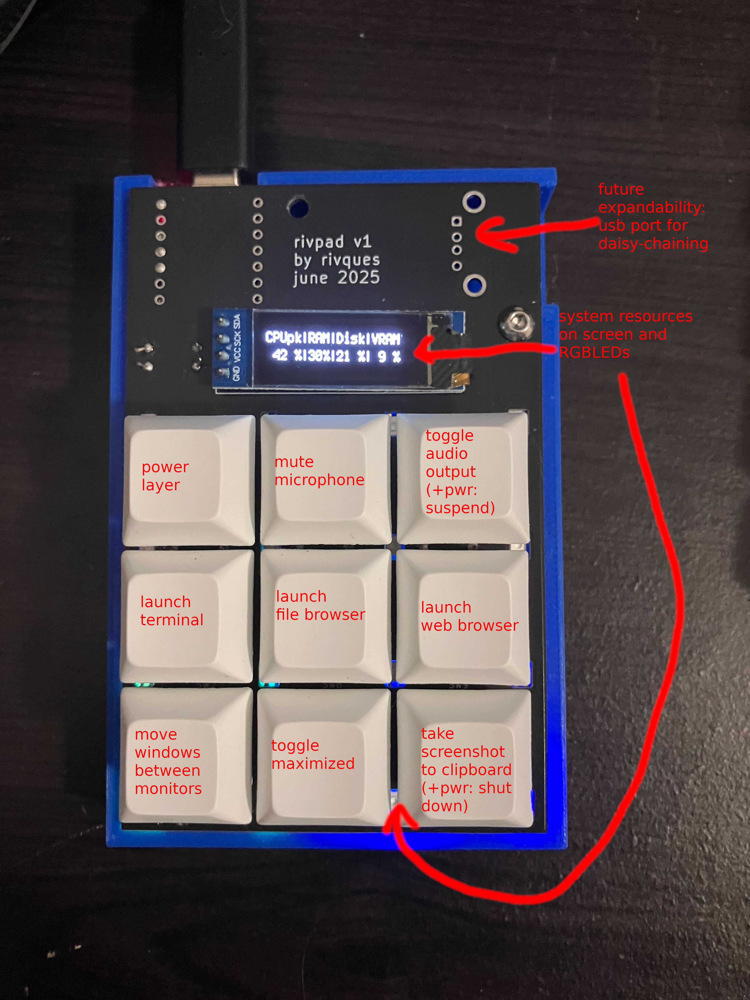

# kanata-config
These are my personal config files for
[kanata](https://https://github.com/jtroo/kanata).
They effectively replace what AutoHotkey did for me on Windows. They are
designed for my peripherals: a Keychron K3, a G502 Hero with the extra buttons
mapped to F14-F22, and the custom Rivpad macropad.

## Setup
Clone this folder to `~/.config/kanata` or similar. First, install kanata and
nata, then symlink kanata.service into the systemd directory and symlink
nata.desktop into the desktop autostart folder. Finally, enable kanata
in systemd.

## Macropad mapping

